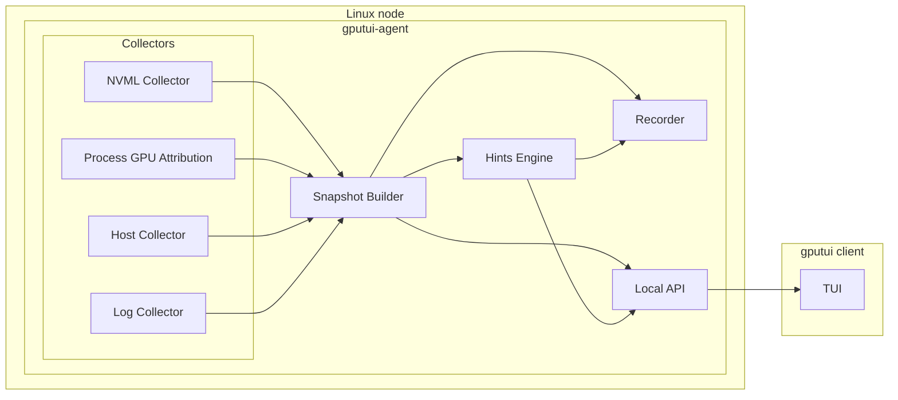
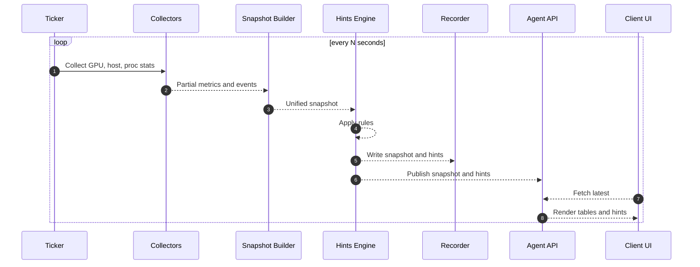

# gputui

[](https://github.com/indraputrabh/gputui/actions/workflows/ci.yml)
[](LICENSE)

GPU + node `top` for Linux that explains *why* your GPUs are slow, not just what's happening.

`gputui` combines **GPU telemetry (NVML)** with **host metrics (`/proc`)** and **kernel log markers (dmesg)** to provide a live, htop-style TUI and a rule-based hints engine that surfaces actionable performance issues with evidence attached.

The engine reads ground-truth NVML signals (clocks-throttle bitmap, performance state, max clocks, violation counters, PCIe link state) directly, so each hint maps to a specific driver signal rather than a guess derived from `temp + power% + util%`.

**Standalone by default**: run `gputui` and see GPU stats immediately -- no separate agent required. For daemon deployments, the agent/client split is available via `gputui --agent <socket>`.

<p align="center">
  
</p>

---

## Quick start

```bash
git clone https://github.com/indraputrabh/gputui.git
cd gputui
make build

./bin/gputui --demo                   # synthetic data, no GPU required
./bin/gputui                          # standalone, real NVML on Linux
./bin/gputui --plain                  # single-shot text output
./bin/gputui-agent --interval 2s &    # background agent
./bin/gputui --agent /tmp/gputui.sock # client connecting to the agent
```

`gputui --help` lists all flags.

---

## Why another GPU `top`?

Tools like `nvidia-smi` and `nvtop` show what the GPUs are doing. They don't tell you *why* utilisation is at 30% when you expected 95%. `gputui` answers that by combining ground-truth NVML signals with host + kernel context, then surfacing rule-based hints with the metrics that triggered them attached.

Each hint maps to a specific driver signal, so the diagnosis is always defensible:

| Hint | Reads (NVML) | What it actually means |
|------|--------------|------------------------|
| `confirmed-throttle` | `nvmlDeviceGetCurrentClocksThrottleReasons` | The driver is currently cutting clocks. HW thermal / HW power-brake = critical (silicon protection); SW thermal / SW power cap = warning (configurable limit hit); operator-set application clocks are filtered out so user-chosen caps don't fire the rule. |
| `gpu-parked` | `nvmlDeviceGetPerformanceState` + memory info | A model is loaded (>1 GB VRAM) but the driver has parked the GPU at P8 or lower. The "loaded but idle" signal -- a process is holding VRAM without running kernels. |
| `memory-bandwidth-bound` | `nvmlUtilization_t.memory` + `.gpu` | SMs are mostly idle but the memory controller is saturated -- a low arithmetic-intensity kernel. Distinct from CPU-bound and IO-bound. |
| `pcie-link-degraded` | `GetCurrPcieLinkGeneration/Width` vs `Max` | PCIe link is running below its negotiated maximum. Common causes: poor seating, riser issues, BIOS link-speed override, slot thermals. |
| `thermal-violation-outlier` | `nvmlDeviceGetViolationStatus(THERMAL)` | One GPU has accumulated significantly more thermal-cap enforcement time than the fleet median. Driven by the cumulative violation counter the driver maintains, so cool GPUs running cooler workloads don't trip it. |
| `nvlink-health` | `GetNvLinkState` + CRC counters | Inactive lanes (only flagged when this GPU has fewer active links than the fleet median, so documented asymmetric topologies don't trigger), or CRC errors accumulating between samples. |
| `gpu-ecc-errors` | `GetTotalEccErrors` | Uncorrectable ECC -> critical (replace the GPU). Correctable ECC -> info (these are auto-corrected by hardware -- informational, not actionable). |
| `potential-cpu-bound-preprocessing` | host `/proc` correlation | Low GPU util + high CPU user time -- consistent with a CPU-bound preprocessing pipeline if a GPU workload is expected. |
| `potential-io-bound-pipeline` | host `/proc` correlation | Low GPU util + high `iowait` -- consistent with an IO-bound data pipeline if a GPU workload is expected. |
| `gpu-xid-error` | `dmesg` (Xid lines) | Surfaces the Xid event verbatim. Codes range across hardware, driver, and software causes -- consult the NVIDIA Xid reference; we do not guess. |
| `host-oom-kill` | `dmesg` (oom-killer lines) | Surfaces the OOM event with the killed process / cgroup. Could be a container limit or host exhaustion. |

Every hint carries the metrics that triggered it, so the diagnosis is always defensible.

> **Note on `nvmlUtilization_t.gpu`**: NVML reports this as the *fraction of the sample window during which any kernel was executing on any SM*, not the fraction of peak FLOP throughput delivered. A GPU running a small memory-bound kernel can read 100% util while delivering <5% of its arithmetic peak. `gputui`'s `memory-bandwidth-bound` hint is the cheap way to spot this case. For deeper arithmetic-intensity profiling, use Nsight or DCGM profiling fields.

---

## Architecture



| Component | Details |
|-----------|---------|
| **NVML Collector** | Per-GPU metrics: util.gpu / util.memory, VRAM, temp, power, clocks (current and max), throttle reasons bitmap, P-state, PCIe gen + width (current and max). |
| **Health Collector** | NVML hardware-health: ECC volatile, NVLink lanes + CRC, remapped rows, per-policy violation counters (thermal, power, sync-boost, board-limit, low-util, reliability). |
| **Process GPU Attribution** | NVML compute/graphics process enumeration + /proc enrichment (CPU%, RSS, IO). |
| **Host Collector** | /proc: CPU, memory, swap, load average. |
| **Log Collector** | dmesg: NVIDIA Xid errors, OOM kill events. |
| **Snapshot Builder** | Unifies GPU + host + proc + log markers into a timestamped snapshot. |
| **Hints Engine** | 11 rules driven primarily by NVML ground-truth signals, wrapped in hysteresis decay so transient borderline conditions don't flap. |
| **Recorder** | JSONL snapshots and hints. |
| **Local API** | Unix socket HTTP server (`/healthz`, `/v1/snapshot`). |
| **TUI** | SSH-friendly terminal UI: GPU table (with throttle / parked badges), process table, hints, sparklines, NVLink + errors-seen panel. |

In standalone mode, the same collectors run inside the `gputui` binary directly -- no agent or socket required.

### Runtime loop



---

## Features

### Live TUI (Bubble Tea)

* **Header bar**: hostname, timestamp, refresh interval, connection status, PAUSED badge
* **GPU table**: per-GPU utilisation bars, VRAM, temperature, power, clocks, sparkline history
* **Process table**: scrollable top GPU consumers (PID, user, command, GPU index, VRAM, util%, CPU%, RSS)
* **Node metrics**: compact CPU/memory/swap bars with load average
* **Hints panel**: active hints with severity badges, confidence, and evidence

### Controls (keyboard)

* `Tab` / `g` / `p` / `h` -- panel focus (GPU, process, hints)
* `s` -- cycle sort (util% -> VRAM -> PID)
* `j` / `k` / `up` / `down` -- scroll process table
* `space` -- pause/resume refresh
* `?` -- help overlay
* `q` -- quit

### Modes

* **Standalone** (default) -- collect and display directly, no agent required
* **Agent** (`--agent <socket>`) -- connect to a running `gputui-agent`
* **Plain text** (`--plain`) -- single-shot text output for scripting/SSH
* **Demo** (`--demo`) -- synthetic data for testing without GPU hardware

---

## Goals and non-goals

### Goals

* `htop`-like experience for GPU nodes: per-GPU and per-process views.
* Single static Go binary, low overhead, SSH-friendly.
* Combine GPU and host signals into **explainable hints**, not just raw metrics.
* Detect stability events (NVIDIA Xid errors, OOM kills) from kernel logs.
* Produce reproducible artifacts (snapshots / hints JSONL) for offline analysis.

### Non-goals

* Not a full monitoring platform (Prometheus/Grafana integration is left to you).
* Not an auto-remediation system (no evictions, taints, or restarts).
* Not deep GPU microarchitecture profiling (use Nsight for that).
* Not universal portability across all distros/kernels (Linux + NVIDIA only for now).

---

## Repo layout

```
.
├── .github/workflows/ci.yml   # build, test, vet, lint, fmt
├── cmd/
│   ├── gputui/                # TUI client + standalone binary (Bubble Tea)
│   ├── gputui-agent/          # Agent binary (collector + API + recorder)
│   ├── gputui-perf/           # Latency CSV harness for the demo pipeline
│   ├── eval-scenarios/        # Optional rule evaluator for JSONL scenarios
│   └── eval-hysteresis/       # Optional hysteresis comparison harness
├── internal/
│   ├── api/                   # Unix-socket client and server
│   ├── collect/               # NVML, host /proc, dmesg, process collectors
│   ├── config/                # Agent and client config
│   ├── hints/                 # Hints engine (evaluator + 11 rules + hysteresis)
│   ├── model/                 # Snapshot, GPUStat, GPUHealthSignal, Hint schemas
│   └── record/jsonl/          # JSONL snapshot and hint recorder
├── docs/
│   ├── CI_PIPELINE.md         # CI workflow reference
│   ├── EVALUATION.md          # Hint validation methodology
│   └── SAMPLING_STRATEGY.md   # Polling intervals, overhead, /proc costs
├── CHANGELOG.md
├── METRIC_MAPPING.md          # NVML/DCGM metric semantics + units reference
├── ROADMAP.md                 # Public roadmap
├── Makefile                   # build / test / vet / lint / fmt / bench
└── README.md
```

---

## Data model

Metric source/unit mapping is documented in [METRIC_MAPPING.md](METRIC_MAPPING.md).

A **Snapshot** is a timestamped view of the node:

* `ts` (UTC)
* `gpus[]` (per-GPU stats)
* `procs[]` (per-process GPU attribution + host stats)
* `node` (cpu/mem/io)
* `markers[]` (log markers: Xid, OOM)
* `hints[]` (derived)

A **Hint** is a performance hypothesis with evidence:

* `name` / `category`
* `severity`
* `confidence`
* `evidence[]` (metrics, thresholds, events)

Both are recorded as one JSON object per line for easy `jq` / pandas analysis.

---

## Build and contribute

```bash
make build      # binaries in ./bin/
make test       # go test -race ./...
make ci         # fmt + vet + lint + test + build
make bench      # go benchmarks (writes to bench_results/)
```

See [CONTRIBUTING.md](CONTRIBUTING.md) for issue / PR conventions.

---

## License

MIT -- see [LICENSE](LICENSE).
